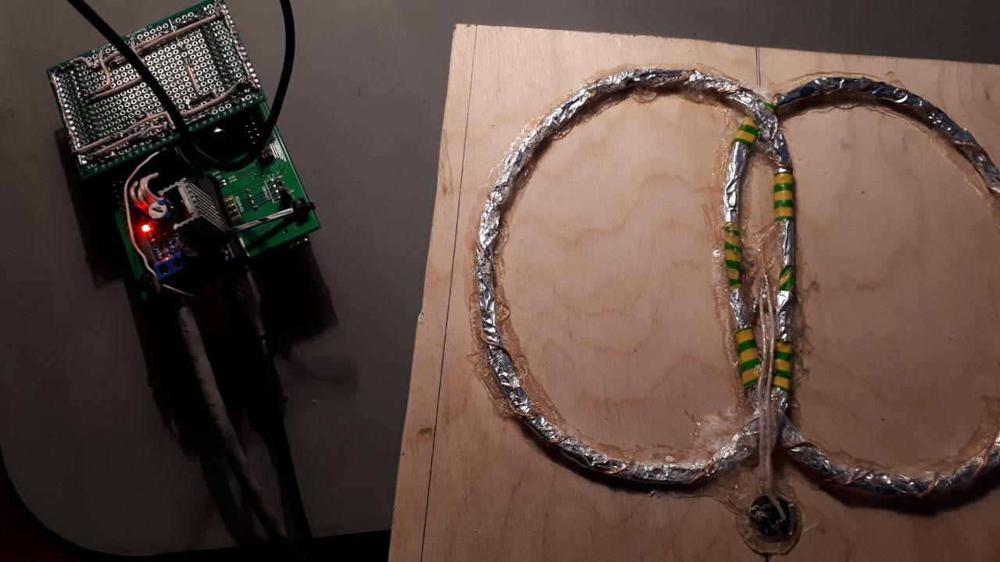

# Система поиска металлических предметов

* [Постановка задачи](#formulation)
* [План работы](#plan)
* [Таблица учета времени](#time)
* [Описание устройства](#device)
* [Источники информации](#references)
* [Инструменты разработки](#tools)

## Постановка задачи

За две недели необходимо разработать металлодетектор, применив отладочную плату STM32F3Discovery.

Технические требования:

* Обнаружение металлических предметов размером от 1 до 20 мм и весом от 100 мг до 20 г, находящихся на поверхности земли, либо в земле на глубине до 100 мм
* Индикация расстояния до предмета
	- Визуальная - изменением яркости светодиодного индикатора
	- Звуковая с пропорциональным изменением частоты от 500 Гц до 10 кГц. Сигнал подается в наушники с разъемом 3.5 мм

## План работы

 №   | Задача | Предполагаемая трудоемкость, дней
 --- | ------ | ---
 0 | Изучение методов обнаружения металлов | 1
 1 | Намотка катушек детектора, испытания  | 2
 2 | Макетирование усилителя сигнала передающей катушки | 2
 3 | Согласование сигнала приемной катушки с АЦП, фиксация катушек между собой | 1
 4 | Разработка встроенного программного обеспечения | 3
 5 | Написание отчета | 1

## Описание устройства

Металлодетектор построен по принципу передача-прием (induction balance). При таком подходе катушки располагаются так, чтобы магнитное поле передающей катушки наводило нулевой сигнал на принимающую.

При появлении вблизи катушек металлического предмета, магнитным полем, в нем наводятся токи Фуко, которые в свою очередь создают магнитное поле с некоторым фазовым сдвигом относительно передающего сигнала.

Основные преимущества данного подхода:

* Более высокая чувствительность, чем у металлоискателей на биениях (beat frequency oscillator)
* Возможность дискриминировать сигналы на основании того, что цветные и черный металлы по разному сдвигают фазу приемного сигнала
* Проще и безопасней в изготовлении, чем индукционные (pulse induction) металлодетекторы, где применяются высокие напряжения и относительно высокие токи в короткие временные периоды

Металлодетекторы на данном принципе являются наиболее популярными на рынке на данный момент, благодаря своей универсальности.

### Детектор на STM32F3Discovery

Передатчик

Приемник

Обработка принятого сигнала и индикация

### Усилитель TX сигнала

Неудачный эксперимент с построением усилителя на TDA2050

*К сожалению было недостаточно времени чтобы решить проблему с самовозбуждением усилителя*

Рабочий усилитель на TDA2030 за 1$ из Китая

### Поисковые катушки

[Различные схемы построения катушек | www.geotech1.com/pages/metdet/info/coils.pdf](https://www.geotech1.com/pages/metdet/info/coils.pdf)

Наиболее оптимальной схемой оказалась катушка по схеме Double D, в связи с относительной простотой ее балансировки.

К сожалению не удалось найти удобных методов расчета необходимой индуктивности катушек, напряженности магнитного поля и амплитуды принимаемого сигнала.

За основу были взяты различные эксперименты из приведенных в конце источников.

Итоговые параметры:

* Медная проволока в изоляции 0.2 мм
* По 70 витков в обоих катушках
* Условный диаметр одной круглой катушки 150 мм
* Ширина двух сбалансированных катушек ~200 мм
* Сопротивление ~17 Ом
* Напряжение в катушке, при питании усилителя от 12 В ~10.5 В

### Фотографии устройства

### Порядок работы

* Подключить землю и передающую катушку к выходу усилителя
* Подключить питание, приемную катушку и разъем усилителя к дочерней плате
* Надеть дочернюю плату на STM32F3Discovery так, чтобы подстроечные резисторы были со стороны платы, где не находится круговой светодиодный индикатор, а крайние контакты разъема 2.54 попали в крайние контакты GND
* Включить отладочную плату в компьютер, подать питание на усилитель
* Задать базовое значение принимаемого сигнала синей кнопкой USER на плате Discovery
* Подстроить резисторы N - порог шума, S - чувствительность (максимальная девиация от базового значения, для построения шкалы дальности до объекта)
* Наблюдать за светодиодным индикатором LD3, внося метал в поле действия катушки
* Опционально можно подключить наушники в разъем 3.5 мм и отрегулировать громкость регулятором V

## Таблица учета времени

| День | Задача | Затрачено часов | Результат |
| ---- | ------ | --------------- | --------- |
| Понедельник 17 | 0 |  4-5            | Понимание  способов построения детекторов |
| Вторник 18     | 1 |  5              | Неудачно выбранная компланарная схема и параметры проволоки вызвали сложности в балансировке приемных и передающих катушек |
| Среда  19      | 1 |  4              | С катушкой по схеме Double D получилось обнаружить изменения в принимаемом сигнале при появлении металла | 
| Четверг 20     | 2, 4 |  2 + 3 + 6   | Освежил знания по операционным усилителям + завел генератор синусоиды на ЦАП + усилитель нестабильно работает в однополярном режиме |
| Пятница 21     | 2 |  6              | Не смогли всем миром победить самовозбуждение усилителя |
| Суббота 22     | 4 |  6              | Организовал структуру проекта, реализовал функцию создания таблицы синусоиды на произвольную амплитуду и количество сэмплов, завел PWM управление светодиодным индикатором детектора |
| Воскресенье 23 | 5 |  2              | Купил готовый усилитель на TDA2030 + начал писать этот отчет |
| Понедельник 24 | 1, 3, 4 | 4 + 1 + 5 | Испытал усилитель, почти закончил катушку, завел АЦП и SWV |
| Вторник 25     | 3, 4 | 9            | Закрепил приемные и передающие катушки, вывел на разъем + эксперименты по оцифровке RX сигнала и синхронизации с выходным |
| Среда 26       | 4 | 10              | Сделал декомпозицию кода, реализовал расчет амплитуды с усреднением и светодиодную индикацию приближения к металлу |
| Четверг 27     | 4 | 10              | Собрал дочернюю плату с разъемами, потенциометрами, и обвязкой АЦП. Реализовал звуковую индикацию и настройку приемника внешними триммерами |
| Пятница 28     | 5 | 5               | Дописал отчет |

## Источники информации
### Металлодетекторы
* Сайт [www.geotech1.com](https://www.geotech1.com/) и книга Inside The Metal Detector ISBN 978-0-9858342-1-0
* Публикация Design and Implementation of a Low Cost VLF Metal Detector with Metal-Type Discrimination Capabilities DOI 10.1109/ICSPC.2007.4728360
* Википедия [en.wikipedia.org/wiki/Metal_detector](https://en.wikipedia.org/wiki/Metal_detector) | [ru.wikipedia.org/wiki/Металлоискатель](https://ru.wikipedia.org/wiki/Металлоискатель)
* [Всё о металлоискателях и металлодетекторах | izmer-ls.ru/met/sche1-1.html](http://izmer-ls.ru/met/sche1-1.html)
* Схожие проекты
	-  [Pulse Induction Metal Detector ENGN3227 Analogue Electronics | users.cecs.anu.edu.au/~Salman.Durrani/_teaching/TA5.pdf](https://users.cecs.anu.edu.au/~Salman.Durrani/_teaching/TA5.pdf)
	- [Импульсный металлодетектор на ардуино FoxyPI | acdc.foxylab.com/node/47](https://acdc.foxylab.com/node/47)
	- [Easy to build pulse induction metal detector with DSP | www.lammertbies.nl/electronics/PI\_metal\_detector.html](https://www.lammertbies.nl/electronics/PI_metal_detector.html)
	- [DIY Metal detector project with PIC12F1572 (or PIC12F1840) microcontroller | www.digiwood.ee/8-electronic-projects/2-metal-detector-circuit](http://www.digiwood.ee/8-electronic-projects/2-metal-detector-circuit)

### Документация STM32
* [UM1570 Discovery kit with STM32F303VC MCU | www.st.com/resource/en/user_manual/dm00063382.pdf](https://www.st.com/resource/en/user_manual/dm00063382.pdf)
* [STM32F303VC Datasheet | www.st.com/resource/en/datasheet/stm32f303vc.pdf](https://www.st.com/resource/en/datasheet/stm32f303vc.pdf)
* [RM0316 Reference manual | www.st.com/resource/en/reference_manual/DM00043574.pdf](https://www.st.com/resource/en/reference_manual/DM00043574.pdf)
* [AN3126 Audio and waveform generation using the DAC in STM32 microcontrollers | www.st.com/resource/en/application_note/cd00259245.pdf](https://www.st.com/resource/en/application_note/cd00259245.pdf)
* [AN4776 General-purpose timer cookbook | https://www.st.com/resource/en/application_note/dm00236305.pdf](https://www.st.com/resource/en/application_note/dm00236305.pdf)
* [AN4195 STM32F30x ADC modes and application | www.st.com/resource/en/application_note/dm00069390.pdf](https://www.st.com/resource/en/application_note/dm00069390.pdf)

### Различная информация
* Курсы [All About Circuits | www.allaboutcircuits.com/education/](https://www.allaboutcircuits.com/education/)

## Инструменты разработки
* STM32CubeIde и STM32F30x\_DSP\_StdPeriph\_Lib\_V1.2.3
* Симулятор схем [www.falstad.com/circuit](https://www.falstad.com/circuit/)
* Калькулятор индуктивностей [coil32.net](https://coil32.net/)
* Калькулятор общего назначения [qalculate.github.io](https://qalculate.github.io/)
* Визуализатор данных, передаваемых по серийному порту [bitbucket.org/hyOzd/serialplot](https://bitbucket.org/hyOzd/serialplot)
